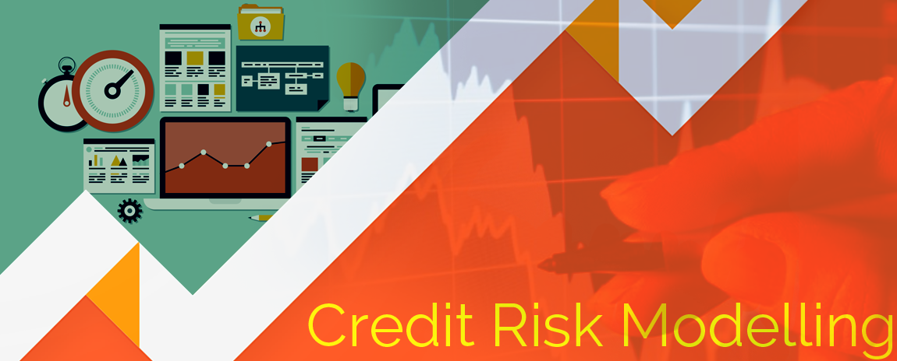
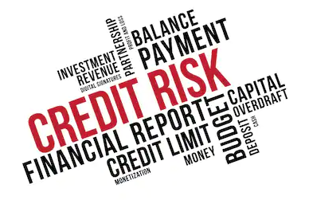
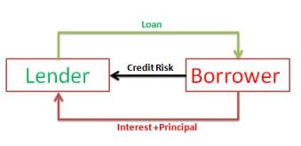
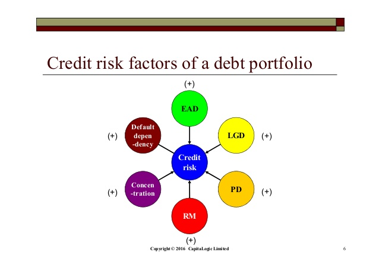

# CreditRiskModelling
Complete outlook as per the **Indsutry standards**  
  

Credit risk modelling is the **best way** for lenders to understand how likley a particular loan is to get repaid, meaning it's a tool to understand the **credit risk of a borrower**. This is espacially important because this credit risk profile **keeps changing** with time and circumstances.

To quote credit union training consultants Dennis Child and Randy Thompson: 
**"We in the lending business witnessed how dramatically loan portfolios can change over relatively short time frames, and how detrimental those changes can be."**

### WHAT IS CREDIT RISK?
**Credit risk** refers to the chance that a borrower will be **unable to make their payments** on time and default on their debt. It refers to the **risk** that a lender may not receive their interest due or the principal lent on time.

This results in an **interruption of cash flows** for the lender and increases the cost of collection. In extreme cases, some part of the loan or even the entire loan may have to be written off resulting in a **loss for the lender.**

  

It is extremely difficult and complex to pinpoint exactly how likley a person is to default on their loan. At the same time, properly assessing credit risk can reduce the likelihood of losses from default and delayed repayment.

Interest payments from the borrower are the **lender's reward** for bearing credit risk. If the credit risk is higher, the lender or investor will either charge a higher interest or forego the lending opportunity altogether.  **For example**, a loan applicant with a superior credit history and steady income will be charged a lower interest rate for the same loan than an applicant woth poor credit history.

### WHAT IS CREDIT RISK MODELLING?
There are many different factors that affect a person's credit risk. This makes assessing a borrower's credit risk a highly complex task. With so much money riding on our ability to accurately estimate the credit risk of a borrower, credit risk modelling has come into the picture.

  

Credit risk modelling refers to the process of using data models to find out two important things: 
1. Proababilty of the borrower defaluting the loan.
2. Impact on the financials of the lender if this default occurs.

Financial institutions rely on credit risk models to determine the credit risk of potential borrwoers. They make decisions on whether or not to sanction a loan as well as on the interest rate of the loan based on the credit risk model validation.

### FACTORS AFFECTING CREDIT RISK MODELLING
There are several major factors to consider while determining credit risk. From the financial health of the borrower and the consequences of default for both the borrower and the creditor to a variety of macroeconomic considerations. Let's look at the below mentioned 3 major factors:

- The Proabability of Default(PD)
  - Likelihood that a borrower will default on their loans and is obviously the most important part of credit risk model.
  - The score is based on the debt-income ratio and existing credit score.

- Loss given Default
  - The total loss that the lender will suffer if the debt is not repaid, a very critical component in credit risk modelling
  - For instance, two borrowers with the same credit score and similar debt-income ratio will present two very different credit risk profiles if one is borrowing a much larger amount.
  
- Exposure at default
  - Measure of the total exposure that a lender is exposed to at any given point of time.
  - Calculated by multiplying each loan by a certain percentage depending on the particulars of the loan.
  
  
### TYPES OF CREDIT RISK RATING MODELS

1. The Models Based on Financial Statement Analysis
  - Models are based on an analysis of financial statements of borrowing institutions.
  - They take into account well known financial ratios that can be useful in determining credit risk.
2. The Models measuring Default Probability
  - Structural models consider business failures to be an endogenous event which depends on the capital structure of the company.
  - In other words, they operate on the assumptions that a business will fail and default on its loans if its value falls below a certain threshold.
3. Machine Learning Models
  - More scientific and accurate.
  - This is the Maximum Expected Utility model which is based on Machine Learning.
  
  
